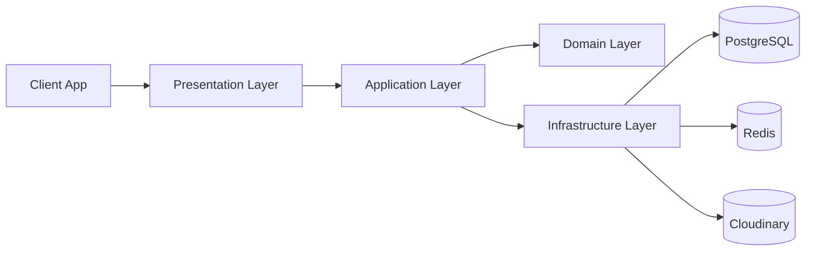

# Learnify LMS API

Backend service for the Learnify Learning Management System, implemented with Spring Boot and organized using a clean architecture approach.

[](https://openjdk.org/)
[](https://spring.io/projects/spring-boot)
[](https://gradle.org/)
[](https://www.postgresql.org/)
[](https://redis.io/)
[](https://opensource.org/licenses/MIT)

## Table of Contents

- [Tech Stack Icons](#tech-stack-icons)
- [System Overview](#system-overview)
- [Architecture Overview](#architecture-overview)
- [Core Stack](#core-stack)
- [Project Layout](#project-layout)
- [Runtime Configuration](#runtime-configuration)
- [Environment Variables](#environment-variables)
- [Security Model](#security-model)
- [API Conventions](#api-conventions)
- [Endpoints](#endpoints)
- [Quick Start](#quick-start)
- [Build and Test](#build-and-test)
- [Docker](#docker)
- [WebSocket Support](#websocket-support)
- [Database Migration](#database-migration)
- [Project Documentation](#project-documentation)
- [Troubleshooting](#troubleshooting)
- [License](#license)

## Tech Stack Icons

<p align="left">
  
</p>

## System Overview

Learnify LMS API currently provides:

- Authentication and token refresh flow
- User profile operations
- JWT-based cookie authentication
- Redis-backed OTP and cache-related infrastructure
- Flyway-managed schema migrations
- Cloudinary-based media upload integration
- SMTP email template infrastructure

The codebase already includes foundational pieces for additional modules (for example WebSocket messaging and extra infrastructure hooks) that can be expanded over time.

## Architecture Overview

The code follows layered boundaries:

- presentation: HTTP layer (controllers, request/response DTOs)
- application: use-cases and orchestration services
- domain: core models and business rules
- infrastructure: persistence adapters, security, external systems
- common: shared constants, base response wrapper, helpers, exceptions



## Core Stack

| Area | Technology |
| --- | --- |
| Language | Java 21 |
| Framework | Spring Boot 3.2.1 |
| Security | Spring Security + JWT |
| ORM/Data Access | Spring Data JPA |
| Main Database | PostgreSQL |
| Caching/Transient Data | Redis (Lettuce) |
| Migrations | Flyway |
| Object Mapping | MapStruct |
| Boilerplate Reduction | Lombok |
| File Storage | Cloudinary |
| Email | Spring Mail |
| Build Tool | Gradle 8.7+ |
| Realtime Transport | Spring WebSocket (STOMP + SockJS) |

## Project Layout

```text
src/main/java/com/learnify/lms/
|- application/       # Application services and interfaces
|- domain/            # Domain models and contracts
|- infrastructure/    # Security, persistence, config, external adapters
|- presentation/      # REST controllers and DTOs
`- common/            # Shared constants, helpers, exceptions, base classes

src/main/resources/
|- application.yml
|- application-dev.yml
|- application-prod.yml
|- db/migration/      # Flyway SQL migrations
`- email/             # Email templates
```

## Runtime Configuration

- Active profile in base config: dev
- Local server port (dev/prod profile files): 8082
- Primary API base URL: http://localhost:8082
- Security CORS origin currently allows: http://localhost:3000

## Environment Variables

The application expects runtime values from environment variables.

| Variable | Required | Purpose | Example |
| --- | --- | --- | --- |
| DB_URL | Yes | PostgreSQL JDBC URL | jdbc:postgresql://localhost:5432/lms_learnify |
| DB_USERNAME | Yes | Database username | postgres |
| DB_PASSWORD | Yes | Database password | postgres |
| REDIS_HOST | Yes | Redis host | localhost |
| REDIS_PORT | Yes | Redis port | 6379 |
| REDIS_PASSWORD | Yes | Redis password (supports auth-enabled Redis) | your_redis_password |
| JWT_SECRET | Yes | Base64-encoded signing key for JWT | your_base64_secret |
| APP_URL | Yes | App base URL used in OAuth callback | http://localhost:8082 |
| GOOGLE_CLIENT_ID | Recommended | Google OAuth2 client id | your_google_client_id |
| GOOGLE_CLIENT_SECRET | Recommended | Google OAuth2 client secret | your_google_client_secret |
| CLOUDINARY_CLOUD_NAME | Recommended | Cloudinary cloud name | your_cloud_name |
| CLOUDINARY_API_KEY | Recommended | Cloudinary API key | your_api_key |
| CLOUDINARY_API_SECRET | Recommended | Cloudinary API secret | your_api_secret |
| STORAGE_PROVIDER | Optional | Storage provider switch | cloudinary |

Example .env values:

```env
DB_URL=jdbc:postgresql://localhost:5432/lms_learnify
DB_USERNAME=postgres
DB_PASSWORD=postgres

REDIS_HOST=localhost
REDIS_PORT=6379
REDIS_PASSWORD=your_redis_password

JWT_SECRET=your_base64_encoded_jwt_secret
APP_URL=http://localhost:8082

GOOGLE_CLIENT_ID=your_google_client_id
GOOGLE_CLIENT_SECRET=your_google_client_secret

CLOUDINARY_CLOUD_NAME=your_cloud_name
CLOUDINARY_API_KEY=your_api_key
CLOUDINARY_API_SECRET=your_api_secret

STORAGE_PROVIDER=cloudinary
```

## Security Model

Authentication uses JWT in HttpOnly cookies.

- Access token cookie name: access_token
- Refresh token cookie name: refresh_token
- Access token includes: sub (user id), roles, type=access
- Refresh token includes: sub (user id), type=refresh
- Cookie settings from current JWT service:
- HttpOnly: true
- Secure: false (current local-friendly setting)
- SameSite: Lax
- Path: /

Token durations (from profile configuration):

- Access token: 900000 ms (15 minutes)
- Refresh token: 604800000 ms (7 days)

Public routes in current security config:

- /api/v1/auth/login
- /api/v1/auth/register
- /api/v1/auth/otp/**

All other routes require authentication.

## API Conventions

The API wraps responses with BaseResponse.

### Success Shape

```json
{
  "success": true,
  "status": 200,
  "message": "Operation successful",
  "result": {},
  "timestamp": "2026-03-23T10:00:00"
}
```

### Error Shape

```json
{
  "success": false,
  "status": 401,
  "error": {
    "errorCode": "UNAUTHORIZED",
    "message": "Unauthorized"
  },
  "timestamp": "2026-03-23T10:00:00"
}
```

## Endpoints

### Auth API

| Method | Path | Auth Required | Description |
| --- | --- | --- | --- |
| POST | /api/v1/auth/register | No | Register a new account |
| POST | /api/v1/auth/login | No | Login and issue auth cookies |
| POST | /api/v1/auth/refresh | No (requires refresh cookie) | Rotate and issue new auth cookies |

Register example:

```bash
curl -X POST "http://localhost:8082/api/v1/auth/register" \
  -H "Content-Type: application/json" \
  -d '{
    "email": "john@example.com",
    "password": "StrongPass@123",
    "fullName": "John Doe",
    "phone": "0912345678"
  }'
```

Login example:

```bash
curl -i -X POST "http://localhost:8082/api/v1/auth/login" \
  -H "Content-Type: application/json" \
  -d '{
    "email": "john@example.com",
    "password": "StrongPass@123"
  }'
```

Refresh example:

```bash
curl -i -X POST "http://localhost:8082/api/v1/auth/refresh" \
  -H "Cookie: refresh_token=<your_refresh_token_cookie_value>"
```

### User API

| Method | Path | Auth Required | Description |
| --- | --- | --- | --- |
| GET | /api/v1/user | Yes | Get current user profile |
| PUT | /api/v1/user | Yes | Update current user profile |
| PUT | /api/v1/user/avatar | Yes | Update avatar image |
| PUT | /api/v1/user/change-password | Yes | Change account password |
| DELETE | /api/v1/user | Yes | Delete current account |

Get profile example:

```bash
curl -X GET "http://localhost:8082/api/v1/user" \
  -H "Cookie: access_token=<your_access_token_cookie_value>"
```

Upload avatar example:

```bash
curl -X PUT "http://localhost:8082/api/v1/user/avatar" \
  -H "Cookie: access_token=<your_access_token_cookie_value>" \
  -F "file=@/path/to/avatar.png"
```

## Quick Start

### 1) Clone the repository

```bash
git clone <your-repository-url>
cd learnify-lms
```

### 2) Prepare dependencies

Required runtime services:

- PostgreSQL
- Redis

Create database:

```sql
CREATE DATABASE lms_learnify;
```

### 3) Configure environment variables

- Add environment variables in your shell, IDE run configuration, or .env approach
- Ensure JWT_SECRET is Base64-encoded for jjwt key decoding

### 4) Start the API

On macOS/Linux:

```bash
./gradlew clean bootRun
```

On Windows:

```powershell
.\gradlew.bat clean bootRun
```

API runs at: http://localhost:8082

## Build and Test

Build artifact:

```bash
./gradlew clean build
```

Run tests:

```bash
./gradlew test
```

## Docker

This repository includes a multi-stage Dockerfile.

Build image:

```bash
docker build -t learnify-lms:latest .
```

Run container:

```bash
docker run --rm -p 8082:8081 --env-file .env learnify-lms:latest
```

Important note:

- Container image exposes port 8081
- Profile configuration defaults to port 8082 for local app execution

## WebSocket Support

WebSocket broker config currently provides:

- STOMP endpoint: /ws (SockJS enabled)
- Broker prefix: /topic
- Application destination prefix: /app

## Database Migration

Flyway migration files are in:

- src/main/resources/db/migration

Migrations run automatically at startup when Flyway is enabled.

## Project Documentation

- API design: [API_Design_Documentation.md](API_Design_Documentation.md)
- Database schema: [LMS_Database_Schema.md](LMS_Database_Schema.md)

## Troubleshooting

Common startup issues:

1. JWT key errors
- Cause: JWT_SECRET is not valid Base64
- Fix: provide a Base64-encoded secret string

2. Database connection failure
- Cause: invalid DB_URL/credentials or PostgreSQL not running
- Fix: verify DB service status and environment values

3. Redis connection failure
- Cause: Redis host/port/password mismatch
- Fix: align REDIS_HOST, REDIS_PORT, REDIS_PASSWORD with your Redis instance

4. CORS blocked requests from frontend
- Cause: frontend origin differs from configured allowed origin
- Fix: update allowed origins in SecurityConfig

5. OAuth callback mismatch
- Cause: APP_URL does not match your runtime host
- Fix: set APP_URL and OAuth provider redirect URI consistently

Infrastructure note:

- docker-compose.yml currently includes MongoDB and Kafka for extended modules. They are not required to run the current auth/profile API flows.

## License

MIT
